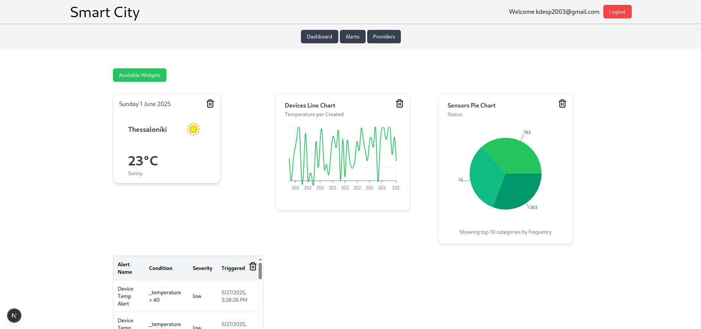
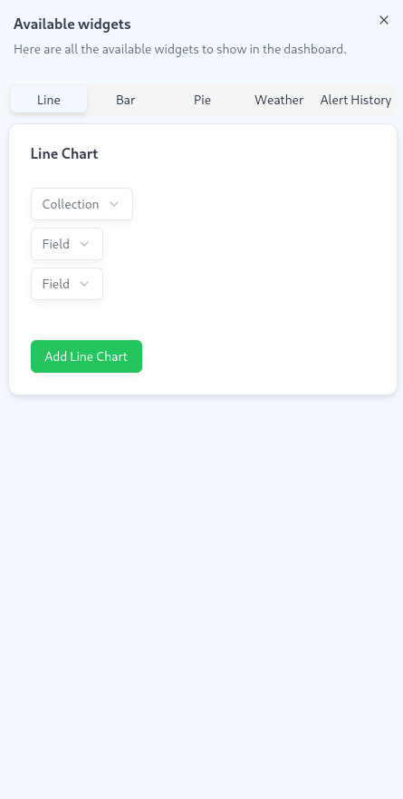
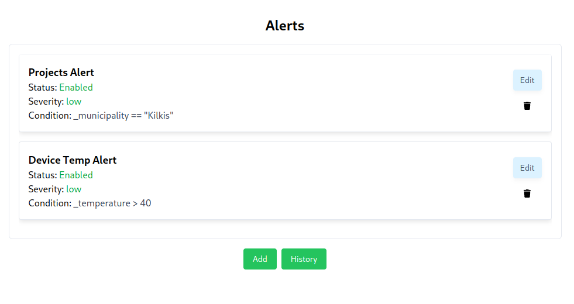
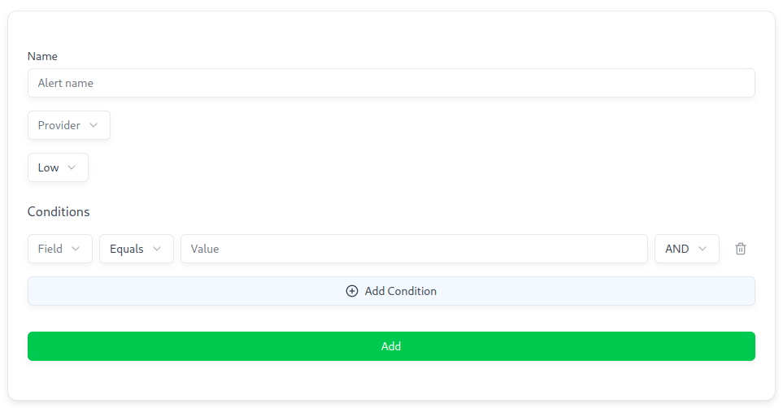
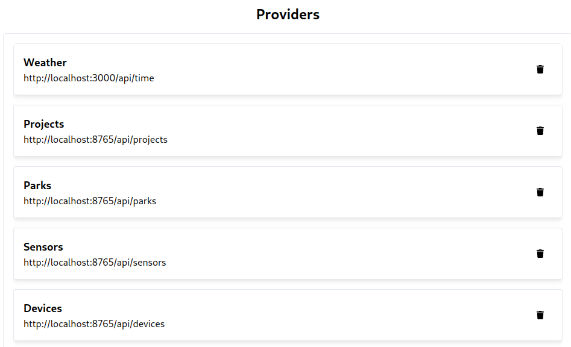
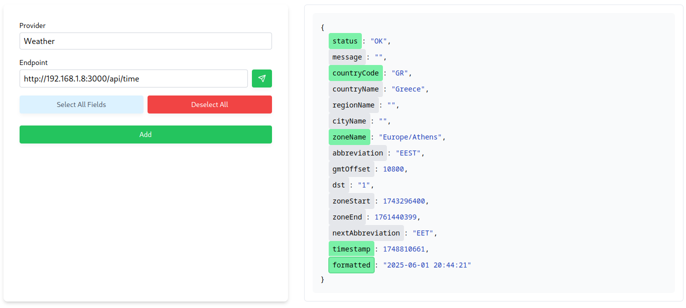

# Smart City Dashboard - LIONCODE

**Αθανάσιος Γεωργαλής** - 2021023  
**Κωνσταντίνος Μώκας** - 2021106  
**Κωνσταντίνος Δεσποινίδης** - 2021035

---

## Στόχος του Έργου

Ανάπτυξη ενός δυναμικού και επεκτάσιμου **Smart City Dashboard**, που συγκεντρώνει, απεικονίζει και επιτρέπει τη διαχείριση δεδομένων από ποικιλία παρόχων υπηρεσιών πόλης (π.χ. μεταφορές, περιβάλλον, ενέργεια).

---

## Τεχνολογίες

### 🔧 Backend: `PocketBase`
- Lightweight BaaS (Backend as a Service)
- **Custom Cron Jobs**: εκτελούνται προγραμματισμένα tasks, όπως έλεγχοι ενημέρωσης.
- **API polling**: ανάκτηση δεδομένων από εξωτερικές πηγές σε τακτά χρονικά διαστήματα.
- **Δυναμική δημιουργία collections** για κάθε νέο provider.
- **Real-time emails** για κάθε triggered alert.

---

### 🧠 Dummy Data Server/Generator: `Python`
- Ορισμός RESTful endpoints
- Προσομοίωση πραγματικών παρόχων με μεταβαλλόμενα δεδομένα (JSON responses)

---

### 🎨 Frontend: `NextJS`
- SSR και dynamic routing για απόδοση και ταχύτητα
- Responsive UI με widgets & διαδραστικότητα

---

## Χαρακτηριστικά UI

### Dashboard - Κεντρική Προβολή

</img>

---

### Custom Widgets

</img>

---

### Alerts System

</img>

---

### Δημιουργία Νέου Alert

</img>

---

### Providers View

</img>

---

### Προσθήκη Νέου Provider

</img>

---

## Οφέλη

- Εύκολη ενσωμάτωση νέων παρόχων
- Άμεση οπτικοποίηση κρίσιμων δεδομένων
- Βάση για εφαρμογές Smart City & IoT monitoring
- Modular και επεκτάσιμο design

---

## Ευχαριστούμε 

Το project ειναι διαθέσιμο εδώ:  
🔗 [github.com/DMG-TechLabs/smart-city](https://github.com/DMG-TechLabs/smart-city)

